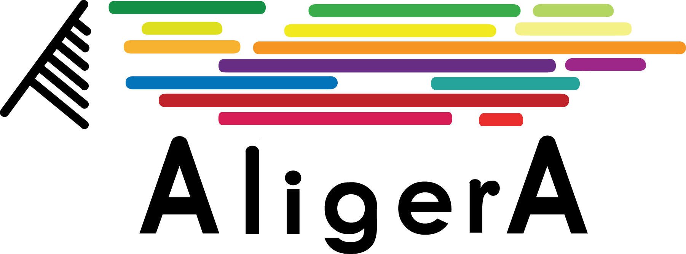

AligerA is a collection of bioinformatics tools for generating nucleotide sequence alignments tailored for species tree inference from noisy and fragmented next generation sequence data, typically obtained from short reads transcriptome sequencing at low/medium coverage depth.

__AligerA core tools are:__
* *primary*: infers primary homology groups using reciprocal all-versus-all BLASTN analysis.
* *secondary*: refines primary homology groups using more stringent E-value for BLAST.
* *phasing*: allows to phase and to assemble haplotypes with SAMtools and VarScan for each homology group.
* *pipeline*: implements a battery of utilities designed to generate and refine multiple sequence alignments out of phased haplotypes from each homology groups. 
